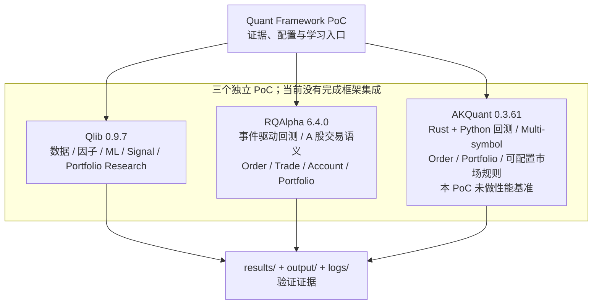

# Quant Framework PoC 中文使用指南

## 项目简介

这是一个量化研究框架的验证和学习项目。它用可追溯的配置、运行日志、结果文件和源码证据，回答三个问题：某个框架能否在当前 macOS arm64 / Python 3.12 环境安装；官方 workflow 或 example 能否完整运行；框架对 A 股研究与回测相关能力提供了哪些已确认的支持。

本项目目前：

- 是三个互相独立的框架 PoC（Proof of Concept，概念验证）；
- 是理解数据、因子、机器学习、组合和事件驱动回测的学习材料；
- 不是完整交易系统；
- 不是自动赚钱系统；
- 不是实盘交易系统，也没有连接真实账户、真实资金或真实持仓。

## 当前进度

| 框架 | 实测版本 | 人工验收 | 本仓库已验证的核心路径 |
|---|---:|---|---|
| Qlib | 0.9.7 | **PASS** | China sample data → Alpha158 → LightGBM → signal/portfolio analysis |
| RQAlpha | 6.4.0 | **PASS** | 官方 A 股 bundle → `buy_and_hold.py` → trade/account/portfolio/report |
| AKQuant | 0.3.61 | **PASS** | AKShare 历史数据 → 官方 quickstart → 三标的订单与组合结果 |

这里的 **PASS** 只表示：官方 workflow/example 已在记录的环境中由 Agent 和用户分别完成可复现验证。它不表示策略能够盈利，不表示已经覆盖全部 2026 年 A 股交易规则，也不表示可以直接用于真实资金。

## 整体架构



Qlib、RQAlpha 和 AKQuant 在本仓库里没有互相调用，也没有形成统一的数据或执行管线。上图中的共同输出只是证据归档，不是三框架集成层。

## 为什么同时研究三个框架

目的不是重复造轮子，也不是提前选出 winner，而是从不同层次理解量化研究：

- Qlib PoC 偏向 Research、Feature/Factor、ML、Signal 和 Portfolio Research；本次已运行 Alpha158、LightGBM 与组合分析。
- RQAlpha PoC 偏向事件驱动 Backtest 和 Execution Semantics；本次已观察 order 对应的成交、持仓、账户和组合输出。
- AKQuant PoC 偏向 Rust + Python 的多标的回测、订单、组合和可配置规则；本次已运行三标的 quickstart，并检查了相关源码和官方 tests。

这三个 PoC 的数据、时间区间、策略和费用口径不同，不能用本仓库中的收益或速度数字直接横向比较。

## 当前仓库已经完成什么

- 固定并记录三框架的实测版本、Python 版本、平台和上游 commit/tag。
- 记录官方安装路径、数据来源及其边界。
- 完整运行并人工复现 Qlib Alpha158 + LightGBM workflow、RQAlpha 官方 buy-and-hold、AKQuant 官方 quickstart。
- 保存精简日志、RQAlpha pickle/CSV/XLSX 报告、依赖快照和能力调查报告。
- 以官方文档、源码路径或官方 tests 记录 A 股、ETF、T+1、涨跌停、停牌和成本模型等能力边界。

## 当前仓库没有完成什么

- 没有把三个框架集成为一个系统，也没有做最终技术选型。
- 没有提供自研策略、Alpha、统一数据层、统一 backtester、setup/bootstrap 脚本或统一 CLI。
- 没有完成全套 2026 年 A 股规则验证，也没有证明任何示例能够盈利。
- 没有做完整 OOS、walk-forward、成本敏感性和 paper trading 研究流程。
- 没有连接 QMT/PTrade、实盘账户、真实持仓或真实资金。

## 项目目录

```text
lianghua/
├── README.md                       # 英文证据入口与原始复现摘要
├── README_ZH.md                    # 本中文理解与使用指南
├── environment.md                  # 已验收机器、Python 与框架版本
├── requirements.txt                # 仅记录 Qlib 顶层依赖，不是统一环境文件
├── configs/
│   └── workflow_config_lightgbm_Alpha158.yaml
│                                      # Qlib PoC 完整配置；含原机器绝对路径
├── scripts/
│   └── verify_qlib_data.py          # 较早一次 Qlib 数据验证脚本
├── qlib/
│   ├── verify_data.py               # 当前 Qlib smoke test
│   ├── workflow_config_local.yaml    # 官方 workflow 的本地 overlay
│   └── output/                       # Qlib 精简日志与依赖快照
├── rqalpha/
│   └── output/                       # RQAlpha 日志、pickle、CSV/XLSX 报告
├── akquant/
│   └── output/                       # AKQuant quickstart/test/install 证据
├── research/factor_v1/
│   ├── config.yaml                    # 固定区间、因子、label 和 timing invariant
│   ├── extract_factors.py             # 调用 Qlib Alpha158，选择五个官方列
│   ├── analyze_factors.py             # IC、Rank IC、分位数和 turnover
│   ├── report.py                      # 生成 Markdown 报告
│   └── output/                        # 运行后生成的 CSV、report 和日志
├── logs/                             # 较早一次 Qlib 运行日志；保留作历史证据
└── results/
    ├── qlib.md                       # Qlib 能力与运行证据
    ├── rqalpha.md                    # RQAlpha 能力与运行证据
    ├── akquant.md                    # AKQuant 能力与运行证据
    ├── comparison.md                 # 不评分的客观事实对照
    └── usability_gap.md              # clone 后可复现性缺口
```

Git 仓库**没有**提交 `.venv/`、下载的 market data / bundle、MLflow store、上游框架源码或官方 example。`output/`、`logs/` 和 `results/` 是已验收证据，通常只读；没有取得新证据时不要改写。重建环境时应在被 `.gitignore` 排除的 `.venv/`、`data/`、`source/` 和 `mlruns/` 中生成本机文件。

## 5 分钟快速开始

### 1. clone 后立即可做的事

```bash
git clone https://github.com/a550580874/lianghua.git
cd lianghua

# 先读结论和可复现性边界
sed -n '1,220p' README_ZH.md
sed -n '1,240p' results/usability_gap.md

# 查看三个框架的证据报告与已有输出
ls results
find qlib/output rqalpha/output akquant/output -maxdepth 2 -type f | sort
```

clone 后可以立刻阅读报告、日志和 RQAlpha CSV/XLSX 导出，但**不能直接运行三个 PoC**。原因是运行所需的虚拟环境、下载数据/bundle、上游源码和官方 example 被有意排除；Qlib 的两个 YAML 还保留原机器绝对路径。

### 2. 当前真实复现路径

当前没有 `git clone → install → run` 的一键路径，也没有统一环境。真实路径是：按下列各框架章节分别重建 Python 3.12 环境，获取固定版本的上游源码和数据，再执行现有命令。详细缺口见 `results/usability_gap.md`。

已验收主机使用 macOS arm64、Homebrew 和 uv。若本机尚未安装 uv / Python 3.12，可先执行：

```bash
brew install uv
uv python install 3.12
```

其他操作系统需要按各框架官方文档调整系统依赖；本仓库没有验证那些平台。

## Qlib 怎么用

### 它在本项目中解决什么问题

Qlib PoC 验证了从样本数据到特征、模型、信号和组合回测的研究链：China sample data → Alpha158 features → LightGBM → predictions → signal analysis → portfolio analysis。

### 重建与运行

以下命令以 macOS 为例；Qlib 0.9.7 的实测环境是 Python 3.12.12，Apple Silicon 还需要 `libomp`：

```bash
git clone https://github.com/a550580874/lianghua.git
cd lianghua

uv venv --python 3.12 .venv
uv pip install --python .venv/bin/python pyqlib==0.9.7
brew install libomp

git clone --branch v0.9.7 --depth 1 \
  https://github.com/microsoft/qlib.git qlib-source

.venv/bin/python -m qlib.cli.data qlib_data \
  --name qlib_data_simple \
  --target_dir qlib/data/cn_data \
  --interval 1d \
  --region cn

.venv/bin/python qlib/verify_data.py
```

运行 Alpha158 + LightGBM 前，把 `qlib/workflow_config_local.yaml` 的 `provider_uri` 改为当前 clone 中 `qlib/data/cn_data` 的**绝对路径**，然后执行：

```bash
cd qlib
MLFLOW_ALLOW_FILE_STORE=true ../.venv/bin/qrun workflow_config_local.yaml \
  --experiment_name qlib-poc-alpha158 \
  --uri_folder output/mlruns
```

数据 smoke test 会显示 Qlib 版本、交易日历、CSI300 数量以及少量 `$close`/`$volume`。workflow 的主要概念是：

- `prediction`：模型对未来标签的预测值；不是买卖承诺。
- `IC`：横截面预测值与实际收益标签的相关性。
- `ICIR`：IC 均值相对其波动的比值，用来观察稳定性。
- `Rank IC`：按排序计算的相关性；`Rank ICIR` 是其稳定性指标。
- `portfolio`：按策略规则形成的模拟组合及每日表现。
- `transaction cost`：配置的开仓、平仓和最低费用对回测的影响。
- `max drawdown`：从历史高点到后续低点的最大回撤。

仓库已有基线日志在 `qlib/output/`，详细结论在 `results/qlib.md`。新运行生成的 MLflow artifacts 会在 `qlib/output/mlruns/`，该目录不提交 Git。

## 因子研究

Factor Research v1 是建立在现有 Qlib PoC 之上的诊断工作流，不是交易策略。它直接读取 Qlib 官方 Alpha158 的原始输出，选择 `ROC20`、`STD20`、`MA20`、`VSTD20`、`CORR20` 五个已有因子，使用官方 label `Ref($close, -2) / Ref($close, -1) - 1`，按 Train / Validation / Test 分段计算描述性统计。它不重新实现因子，不训练 LightGBM，不做因子组合优化，不生成 TopK 组合或买卖信号。

### 运行

先按上面的 Qlib 章节重建 `.venv` 和 `qlib/data/cn_data`。从仓库根目录执行，`--provider-uri` 必须指向本机已经重建的 Qlib sample data：

```bash
mkdir -p research/factor_v1/output

.venv/bin/python research/factor_v1/extract_factors.py \
  --provider-uri /absolute/path/to/qlib/data/cn_data \
  2>&1 | tee research/factor_v1/output/acceptance.log

.venv/bin/python research/factor_v1/analyze_factors.py \
  2>&1 | tee -a research/factor_v1/output/acceptance.log

.venv/bin/python research/factor_v1/report.py \
  2>&1 | tee -a research/factor_v1/output/acceptance.log
```

这是三个独立步骤：第一步调用 Qlib Alpha158 并保存选定列，第二步只做统计分析，第三步把 CSV 渲染成 Markdown。若数据不存在、Qlib 未安装或远程数据无法重建，结果是 `BLOCKED`，不应自行补写因子。

### 输出

结果位于 `research/factor_v1/output/`：

- `factor_summary.csv`：每个因子在每个 split 的 IC mean/std/ICIR、Rank IC mean/Rank ICIR、Q5-Q1 spread 和 top-quantile turnover。
- `factor_ic_by_year.csv`：按年度的 IC、Rank IC 和样本数，用于观察时间稳定性。
- `quantile_returns.csv`：每日横截面五分位汇总后的各组平均 forward return、Q5-Q1 spread 和原始方向单调性标记。
- `turnover.csv`：top Q5 的相邻交易日 turnover；公式在 `report.md` 中明确写出。
- `report.md`：包含 Data、Universe、Label、Factors、Train/Validation/Test Results、IC Stability、Quantile Analysis、Turnover、Observations、Limitations。
- `acceptance.log`：本次实际执行日志；`factors.csv.gz` 是较大的原始中间文件，默认不提交 Git。

IC 是横截面因子值与 forward return 的相关性，ICIR 是 `IC mean / IC std`；Rank IC 使用排序后的相关性。Quantile analysis 按每个交易日把股票分成 Q1–Q5，保留原始因子方向，不因为观察到负相关而偷偷翻转。Turnover 定义为 `1 - overlap(previous top Q5, current top Q5) / previous top Q5 size`。

### 防止未来数据

因子值来自当日 Alpha158 输出，label 由 Qlib 官方 forward-return 表达式生成；脚本只按固定日期切分，不用 Test 结果修改因子或参数。这里的 label 时序解释沿用 Qlib 文档，不等价于已经验证完整的 A 股投资组合 T+1 执行规则。

## RQAlpha 怎么用

### 它在本项目中解决什么问题

RQAlpha PoC 主要验证 A 股日线 bundle、事件驱动回测，以及从下单到成交、持仓、账户和组合结果的链路。

- `Order`：策略发出的交易指令，包含标的、方向、数量和价格类型。
- `Trade`：订单实际撮合出的成交记录；一个订单理论上可以对应多个成交。
- `Position`：账户当前持有的某个标的数量和市值等状态。
- `Account`：现金、持仓市值、费用和权益等账户级状态。
- `Portfolio`：所有账户和持仓汇总后的组合净值与收益表现。

### 重建与运行

```bash
git clone https://github.com/a550580874/lianghua.git
cd lianghua

uv venv --python 3.12 --seed rqalpha/.venv
rqalpha/.venv/bin/python -m pip install rqalpha==6.4.0

git clone --branch release/6.4.0 --depth 1 \
  https://github.com/ricequant/rqalpha.git rqalpha/source

rqalpha/.venv/bin/rqalpha download-bundle -d rqalpha/data --confirm
rqalpha/.venv/bin/rqalpha check-bundle -d rqalpha/data

cd rqalpha
.venv/bin/rqalpha run \
  -f source/rqalpha/examples/buy_and_hold.py \
  -d data/bundle \
  -s 2016-06-01 \
  -e 2016-12-01 \
  --account stock 100000 \
  --benchmark 000300.XSHG \
  -o output/manual_acceptance.pkl

mkdir -p output/manual_report
.venv/bin/rqalpha report output/manual_acceptance.pkl output/manual_report
```

`check-bundle` 的验收基线是 `good bundle's day bar`。已有日志、pickle 和报告位于 `rqalpha/output/`；可读导出包括 `trades.csv`、`portfolio.csv`、`stock_account.csv`、`stock_positions.csv`、`positions_weight.csv` 和 `summary.xlsx`。能力与费用边界见 `results/rqalpha.md`。

## AKQuant 怎么用

### 它在本项目中解决什么问题

AKQuant PoC 验证了 Rust 核心 + Python API 的多标的回测、订单、组合汇总和可配置市场规则。官方 quickstart 使用 AKShare 拉取三只 A 股历史数据，再运行两天回测。

### 重建与运行

```bash
git clone https://github.com/a550580874/lianghua.git
cd lianghua

uv venv --python 3.12 --seed akquant/.venv
akquant/.venv/bin/python -m pip install akquant==0.3.61 akshare==1.18.96

git clone --branch v0.3.61 --depth 1 \
  https://github.com/akfamily/akquant.git akquant/source

cd akquant
.venv/bin/python source/examples/01_quickstart.py
```

输出中的主要概念是：

- `BacktestResult`：一次回测的汇总对象。
- `execution_count`：本次产生的成交数量；验收基线为 3。
- `open_position_count`：回测结束时仍持有的仓位数量；验收基线为 3。
- `commission`：模拟成交费用；示例为每笔最低 CNY 5，总计 15。
- `drawdown`：组合从阶段高点回撤的幅度。
- `orders`：订单明细，包括标的、方向、数量、成交价、费用和状态。

AKShare 是远程公共数据依赖，不是仓库内的固定 bundle。数据可能修订，接口也可能暂时不可用，所以未来运行结果或可用性不能仅由当前 PASS 保证。基线日志在 `akquant/output/01_quickstart.log`，详细边界在 `results/akquant.md`。

## 三个框架有什么区别

| 客观维度 | Qlib | RQAlpha | AKQuant |
|---|---|---|---|
| 本 PoC 的重点 | 因子、ML、信号、组合研究 | 事件驱动回测和 A 股交易语义 | Rust + Python 多标的回测和可配置规则 |
| 实际运行 | Alpha158 + LightGBM + CSI300 | 官方 buy-and-hold | 官方三标的 quickstart |
| 数据路径 | Qlib China sample data | RiceQuant free daily bundle | AKShare 远程历史数据 |
| 订单/成交 | 本阶段只验证日频组合研究链 | 产生 trade/account/position/portfolio | 产生三笔 filled orders 和组合结果 |
| ML | 已运行 LightGBM workflow | 本阶段未验证 ML | 存在相关 API；本阶段未运行 ML example |
| A 股规则边界 | 完整 T+1、板块/ST/日期涨跌停未验证 | 有较多源码语义证据；部分 2026 规则仍需验证 | 规则高度依赖配置；daily limit 实现未找到 |
| clone 后直接运行 | 否：缺环境、数据、上游源码，且 YAML 含绝对路径 | 否：缺环境、bundle、上游源码/example | 否：缺环境、上游源码/example，且依赖远程 AKShare |

这张表只描述本仓库已经验证的事实，不是评分、排名、winner 或最终架构选择。

## 我应该从哪个开始学习

这不是框架排名，而是按学习目标导航：

- 想学习因子、机器学习和信号评估：先读 `results/qlib.md`，再看 Qlib 配置和日志。
- 想学习事件驱动回测，以及 Order、Trade、Position、Account、Portfolio：先读 `results/rqalpha.md` 和 `rqalpha/output/manual_report/`。
- 想学习 Rust + Python 回测架构和多标的订单输出：先读 `results/akquant.md` 和 quickstart 日志；本 PoC 没有做性能基准。
- 想学习完整量化研究流程：三个 PoC 之后应进入 Research Workflow Phase，而不是再增加框架。

## 一个量化研究最终应该怎么走

```text
Data
  ↓
Universe
  ↓
Feature / Factor
  ↓
Signal
  ↓
Portfolio
  ↓
Backtest
  ↓
Transaction Cost
  ↓
Out-of-Sample
  ↓
Walk-forward
  ↓
Paper Trading
  ↓
Small Capital Live Trading
```

当前项目只完成了其中一部分基础设施和官方示例验证。尤其是 OOS 研究设计、完整 walk-forward、成本敏感性、paper trading 和实盘安全流程都没有完成。

## 已知限制

### Qlib

- `qlib_data_simple` 日历截止 2021-06-11，不能代表当前市场。
- 对应最后一个非空官方 forward label 是 2021-06-09；当前 workflow Test 截止 2020-08-01。样本较新日期的 CSI300 成员存在缺少 feature 目录的标的，扩展日期前需要另做覆盖率检查。
- 官方 Microsoft dataset 当时不可用；官方 CLI 实际从社区托管快照下载，底层示例数据被提示来自 Yahoo Finance 且可能不完美。
- 本 PoC 没有独立校验数据正确性，也没有验证完整 A 股 T+1、停牌、板块/ST/日期涨跌停和完整税费规则。

### RQAlpha

- 当前实现中没有找到明确的 A 股 transfer fee 模型，因此为 `UNKNOWN / NEEDS CURRENT-RULE VALIDATION`。
- T+1、涨跌停、停牌和费用存在源码/文档证据，但本次官方 example 没有逐项形成完整 Golden Case。
- 默认 commission、stamp tax 和其他费用不能直接假定符合 2026 年实际规则。

### AKQuant

- quickstart 没有启用完整中国市场规则，`t_plus_one` 未启用，示例税费不代表 2026 实际费率。
- A 股 daily limit rule 为 `NOT FOUND / NEEDS CURRENT-RULE VALIDATION`。
- ETF stock/bond/money/cross-border 子类型不会自动分类规则。
- 停牌主要是 zero-volume / missing-slice 语义，不是权威停牌日历。
- AKShare 是远程公共数据依赖，没有不可变的仓库内数据快照。

## 下一阶段

下一阶段不应增加第四个框架。建议进入 **Research Workflow Phase**：选择公开、成熟、可复现的研究对象，建立并记录以下闭环：

```text
数据 → 因子/策略 → 实验 → 回测 → OOS → Walk-forward → 成本敏感性 → 报告
```

本次 Documentation & Usability Phase 只整理现状与可复现性缺口，不开始实现 Research Workflow。
